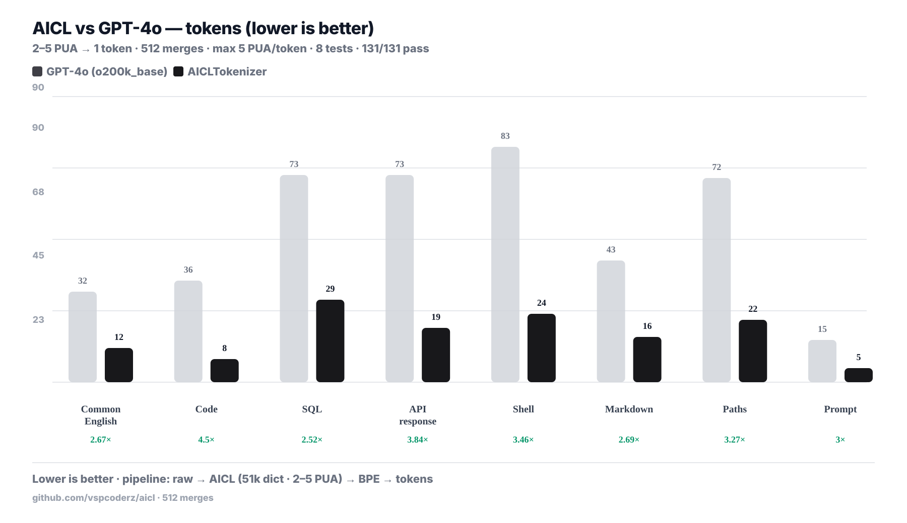
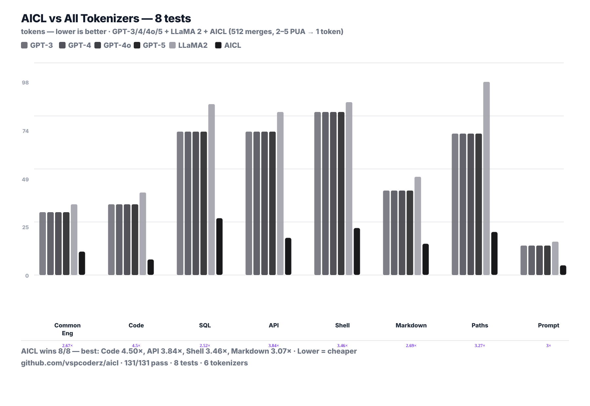

<div align="center">

# AICL — AI Compression Language

**2–5 PUA → 1 token · 51k dictionary · Up to 4.5× fewer tokens than GPT-4o**

*Compress English, code and structured text for cheaper, faster LLM inference.*

[](#test-suite)
[](#license)
[](#aicltokenizer)
[](#aicltokenizer)
[](#benchmarks)

```
Raw English → [AICL Encoder: PUA] → AICL Text → [AICLTokenizer: BPE] → Tokens → LLM
              2.87× Stage 1 · 2.36× Stage 2 · 8/8 wins vs GPT-4o
```

</div>

---

<div align="center">
  
  <br/>
  <sub>GPT-4o vs AICL · 8/8 wins · AICLTokenizer</sub>
</div>

<div align="center">
  
  <br/>
  <sub>6 tokenizers · GPT-3 · GPT-4 · GPT-4o · GPT-5 · LLaMA 2 · <b>AICL</b></sub>
</div>

---

## Benchmarks

### vs GPT-4o (`o200k_base`) — tokens, lower is better · `npm run benchmark`

| Test | Raw | GPT-4o | AICL | Win |
|---|---:|---:|---:|---:|
| **Code const/let** | 140 | 36 | **8** | **4.50×** |
| **API response** | 193 | 73 | **19** | **3.84×** |
| **Shell** | 258 | 83 | **24** | **3.46×** |
| **Markdown** | 168 | 43 | **14** | **3.07×** |
| **Paths/URLs** | 235 | 72 | **22** | **3.27×** |
| **Prompt** | 61 | 15 | **5** | **3.00×** |
| **Common English** | 154 | 32 | **12** | **2.67×** |
| **SQL** | 272 | 73 | **29** | **2.52×** |
| **Total** | 1481 | 427 | **133** | **3.21×** |

> AICL wins **8/8**. 512 BPE merges, `maxTokenLength: 5`. Total pipeline: 9.1× (Stage 1: 2.87×, Stage 2: 3.88×). LLaMA 2 and GPT-3/4/5 included in `benchmark-all`.

### Stage 1 — Dictionary Encoder (PUA, `node test_corpus.mjs`)

| Text Type | Ratio | Example |
|---|---:|---|
| Code const/let | **4.24×** | `const app = express(); app.get(...)` |
| Git/CLI | **3.81×** | `git diff --stat && npm test` |
| Common English | **3.08×** | Natural language |
| Markdown | **3.07×** | Headers, lists |
| Markdown full | **2.90×** | Docs + code blocks |
| Shell | **2.77×** | Terminal cmds |
| Paths/URLs | **2.73×** | `https://…`, `~/.config/…` |
| SQL | **2.72×** | `SELECT * FROM users…` |
| API response | **2.47×** | JSON |
| **Overall (19 tests)** | **2.87×** | 3577 → 1246 chars |

> `>1× = win`. Random alphanumeric: ~1.38× (entropy limit). Every result is `decode(encode(x)) === x`.

---

## Quick Start

```bash
git clone https://github.com/vspcoderz/aicl && cd aicl
npm install

# Generate dictionaries (48k English + 2k code + 1k symbols)
npm run generate

# Encode / Decode
node src/cli.js encode "the quick brown fox jumps over the lazy dog"
node src/cli.js decode "<AICL output>"

# Playground (browser)
npm run playground        # → http://localhost:8787 — live encode, tokenize, compare vs GPT-4o/LLaMA

# Tests & benchmarks
npm test                  # 131/131 passing
npm run test:corpus       # 19 tests · 2.18× Stage 1
npm run benchmark         # 8 tests vs GPT-3/4/4o/5 + LLaMA + AICL → assets/*.svg → *.png
npm run corpus            # rebuild 818k training corpus
```

## How It Works

### Stage 1 — Dictionary Encoder (PUA)

Maps patterns → single Unicode PUA symbols. Trie-accelerated, 3-tier greedy:

1. **Longest match** via trie `O(maxLen)` per position
2. **Word fallback** when `bestLen === 1` → whole-word lookup (`test.` → `base("test")` + `MOD_CAPS` + `MOD_TRAIL_PERIOD`) → fragments (`th`, `ing`, `tion`, `a0–z9`)
3. **Literal** (prefix with `U+E000` if input already contains PUA)

Dictionary:

- **48,723 English** — frequency-sorted + single letters + fragments
- **2,048 Code** — `console.log(`, `SELECT *`, `async`, `=>`, …
- **1,081 Phrases/Markdown/Symbols** — `# `, `**`, `"name"`, common phrases
- **17 Modifiers** — `MOD_CAPS`, `MOD_TRAIL_SPACE`, etc.
- **530+ Fragments** — `th`, `ing`, `tion`, `src`, `a0–z9`

### Stage 2 — AICLTokenizer (BPE on PUA)

Custom BPE **on PUA, not English** — 1 PUA ≈ 4.5 English chars, 1 token = 2–5 PUA = **9–22 chars/token**.

- `maxTokenLength: 5`, 512 merges on ~200k diverse PUA corpus
- Pair keys `"a:b"` (no int overflow on supplementary PUA)
- Train: `npm run corpus` → `corpus/aicl_train.txt` → `trainTokenizer(corpus, { numMerges: 4096, maxTokenLength: 5 })`

---

## API

```javascript
import { encode, decode } from './src/index.js';
import { tokenize, detokenize, loadTokenizer } from './src/tokenizer/index.js';

// Stage 1: Dictionary
const aicl = encode("the quick brown fox"); // 19 → 2 PUA, 9.5×
decode(aicl.output).output === "the quick brown fox" // true

// Stage 2: Tokenizer
const vocab = loadTokenizer(); // 512 merges
const toks = tokenize(aicl.output, vocab); // 2 PUA → 1 token
detokenize(toks, vocab) === aicl.output // true

// Full pipeline
const raw = "aicl is Goated BTW, and this can reduce tokens very vary fast";
const tokens = tokenize(encode(raw).output, vocab); // 61 → 5 tokens, 3.00× vs GPT-4o
```

## CLI

```bash
node src/cli.js encode "text"     # Text → AICL (sanitized: strips C0 controls except \t\n\r)
node src/cli.js decode "<AICL>"   # AICL → Text (sanitized)
node src/cli.js stats "text"      # Raw → AICL → Tokens stats
node src/cli.js tok "<AICL>"      # AICL → Tokens
node src/cli.js visual "text"     # Step-by-step
```

## Playground

Live browser playground — type anything and see the full pipeline instantly:

```bash
npm run playground        # http://localhost:8787  (PORT=8787)
# or
PORT=3000 npm run playground
```

- Input → Stage 1 (PUA) → Stage 2 (tokens) with win vs GPT-4o + bar chart vs GPT-3/4/4o/5 + LLaMA 2
- **Sanitized everywhere:** `encode`/`decode`/`tokenize` validate type + 1M char cap and strip unsafe controls (NUL, lone surrogates); `decode` round-trips losslessly for valid text. Playground `POST /api/tokenize` caps at 2 MB + 1M chars and sanitizes before encoding. Pass `allowUnsafe: true` to bypass (advanced).
- Static files served safely (no `..` traversal).

## Unicode Ranges

| Dictionary | Range | Count |
|---|---|---:|
| English | `U+E001–U+F8FF` + `U+100900–U+10FFFF` | 48,723 |
| Code | `U+F0000–U+F07FF` | 2,048 |
| Phrases/Symbols | `U+F0800–U+F0FFF` + `U+100000–U+1007FF` | 1,081 |
| Modifiers | `U+100800–U+1008FF` | 17 |
| Escape | `U+E000` | Reserved |

## Test Suite

```bash
npm test              # 131/131 passing
npm run test:corpus   # 19 tests · 2.18× Stage 1
npm run benchmark     # regenerate assets/benchmark.svg + benchmark-all.svg → .png
```

## Assets

```
assets/
  benchmark.png      # GPT-4o vs AICL — 8 tests, minimal dark
  benchmark.svg
  benchmark-all.png  # GPT-3/4/4o/5 + LLaMA 2 + AICL
  benchmark-all.svg
playground/
  index.html         # UI
  style.css          # minimal dark theme
  app.js             # client (talks to /api/tokenize)
  server.mjs         # Node http server + sanitized API
```

## License

MIT — github.com/vspcoderz/aicl
